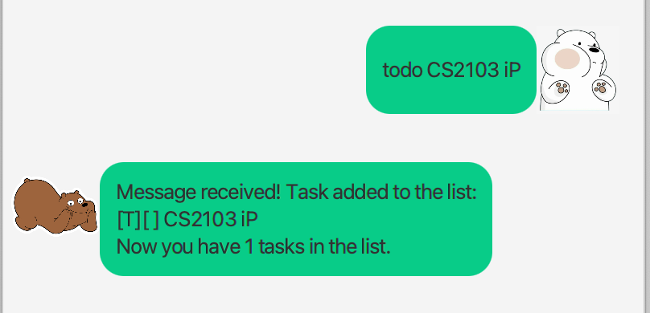
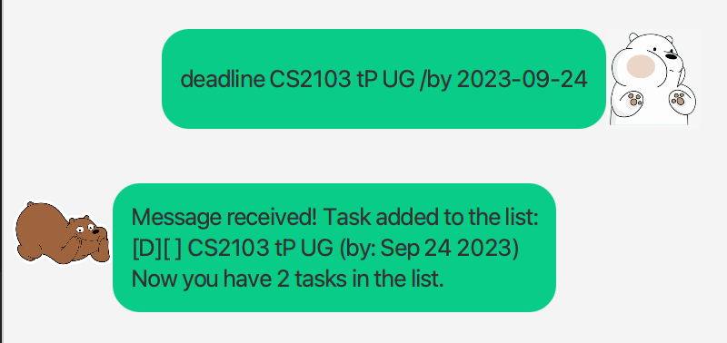
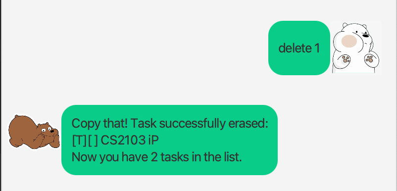
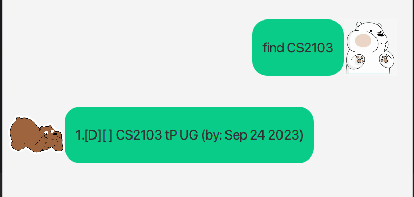
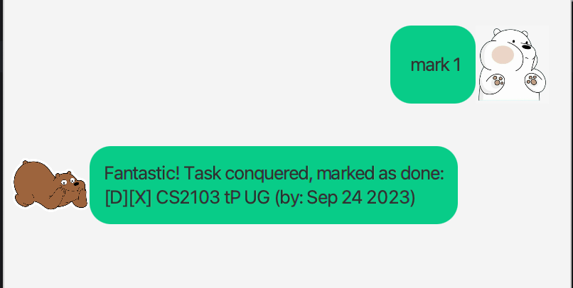

# User Guide

### Dommi - Task Manager Chatbot
Dommi is a desktop app for managing tasks, optimized for use via a Command Line Interface (CLI) while still having the benefits of a Graphical User Interface (GUI). If you can type fast, Dommi can get your tasks management done faster than traditional GUI apps.

## Quick Start
1. Ensure you have `Java 11` or above installed in your Computer.
1. Download the latest `addressbook.jar` from here (to be added).
1. Copy the file to the folder you want to use as the home folder for your AddressBook.
1. Open a command terminal, `cd` into the folder you put the jar file in, and use the `java -jar addressbook.jar` command to run the application.
A GUI similar to the below should appear in a few seconds. Note how the app contains some sample data.

## Usage 
Here’s how to use Dommi.

#### Add Todo: `todo` 
Add a todo task into the task list.
Format: `todo NAME`
- Examples: `todo CS2103 iP`

#### Add Deadline: `deadline` 
Add a deadline into the task list.
Format: `deadline NAME /by DATE`
- Examples: `deadline CS2103 tP UG /by 2023-09-24`

#### Add Event: `event` 
Add an event into the task list.
Format: `event NAME /from FROMDATE /to TODATE`
- Examples: `event Hackathon /from 2023-09-22 /to 2023-09-24`

#### Delete Task: `delete` 
Delete a task from the task list.
Format: `delete TASKID`
- Examples: `delete 1`

#### Display Tasks: `list` 
Display all the tasks in the task list.
Format: `list`
- Examples: `list`

#### Find Task: `find` 
Search for specific tasks in the task list.
Format: `find QUERY`
- Examples: `find CS2103`

#### Mark Task: `mark` 
Mark given task as done.
Format: `mark TASKID`
- Examples: `mark 1`

#### Unmark Task: `unmark` 
Unmark given task as done.
Format: `unmark TASKID`
- Examples: `unmark 1`

#### Bye: `bye` 
Exit the chatbot.
Format: `bye`
- Examples: `bye`

#### Saving the data
Tasks data are saved in the hard disk automatically after any command that changes the data. There is no need to save manually.

#### Editing the data file
Tasks data are saved automatically as a txt file [JAR file location]/data/tasks.txt. Advanced users are welcome to update data directly by editing that data file.
